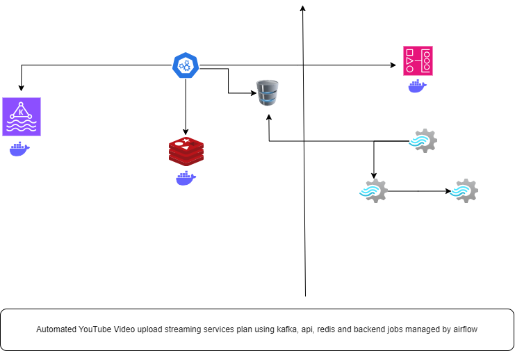

# Automated_Video_Upload_Streaming_Service
Automated Video upload streaming services plan using kafka, api, redis and backend jobs managed by airflow.
- [Automated\_Video\_Upload\_Streaming\_Service](#automated_video_upload_streaming_service)

## Backend Jobs Managed By Airflow

## Kafka Streaming Service

    a. An api subscribed to kafka topic.
    b. An api sourcing the kafka producer to produce messages on a topic.

## API

    a. Flask Server
    b. Has an api for user_interface(Chat bot integration) which takes the messages and source it to the kafka producer.
    c. Has an api which is listening to subscribed kafka topic.
    d. Flask-Redis configuration to reply immediately from redis cache server.

## Database

    a. Database for kafka, airflow and redis.
    b. Database for API, preffeably mongo or cosmos db.

